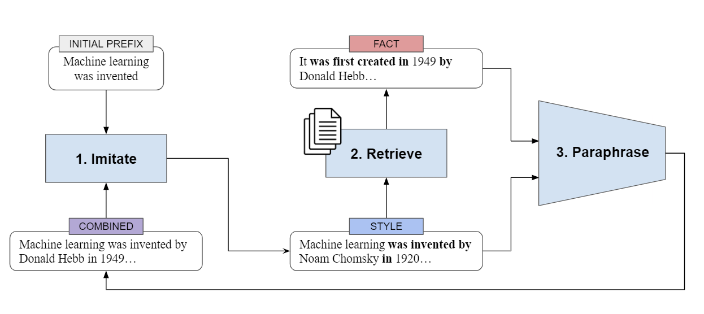

# Expository Document Generation

## Overview

This code contains the Imitate, Retrieve, Paraphrase (IRP) framework for expository document generation. The framework leverages a set of topic-related factual sentences and a user-specified prefix in order to generate an expository document.



## Setup

Python 3.8.12 and pip 21.3.1 were used when running this module. A list of requirements can be found in `requirements.txt`, which can be installed through the following command:
```
pip install -r requirements.txt 
```

All models/datasets needed to test IRP can be found on huggingface at [this link](https://huggingface.co/nbalepur).

The most important files in this repository are as follows:
* `src/IRP.ipynb/`: demo code (discussed in demo video below) for demonstrating how each of the components work in the IRP framework
* `src/IRP.py/`: full IRP model for expository document generation


## Functional Design (Usage)

After navigating to `IRP.py`, simply run the code by running the command:

```
python IRP.py
```

The following parameters need to be specified in the first few lines of the file:

* `device`: run the model on `cuda` or `cpu`
* `dataset_name`: where the input/output pairs for expository document generation come from on huggingface (`nbalepur/college_desc_refined2`, `nbalepur/medline_medicine_desc_refined`, `nbalepur/cs_history_desc_refined2`)  
* `input_column_name`: whether to use the "leaked" or "non-leaked" version of the dataset (`web_sentences_with_desc` or `web_sentences_no_desc`)
* `output_dir`: where to save the results to
* `imitator_model_name`: the name of the imitator model on huggingface (`nbalepur/gpt2_college_desc`, `nbalepur/gpt2_medicine_bio`, `nbalepur/gpt2_cs_history_lg`)
* `paraphrase_model_name`: the name of the paraphraser model on huggingface (see models from `nbalepur`)
* `retriver_model_name`: the name of the retriever model on huggingface (see models from `nbalepur`)
* `k`: number of facts for the retriever to return 
* `get_prefix(topic)`: initial prefix for the expository document. returns a string, which can optionally use the topic of the document

## Demo video

<a href="https://drive.google.com/file/d/1EzU7N72KTsYrJgs5XnaHGda0CfZX8Osj/view?usp=sharing" title="Link Title">Video</a>


## Algorithmic Design 

For a detailed description of the algorithm, please reference [this link](https://www.overleaf.com/read/pdzrwwvvcpms).


## Issues and Future Work

Below, we list some possible areas for improvement:

* Difficulty dealing with expository documents that follow less uniform content planning (e.g. Wikipedia)
* Slightly long inference time for a single document ( ~ 30 sec)


## References 

All relevant references are linked in the [paper](https://www.overleaf.com/read/pdzrwwvvcpms).
